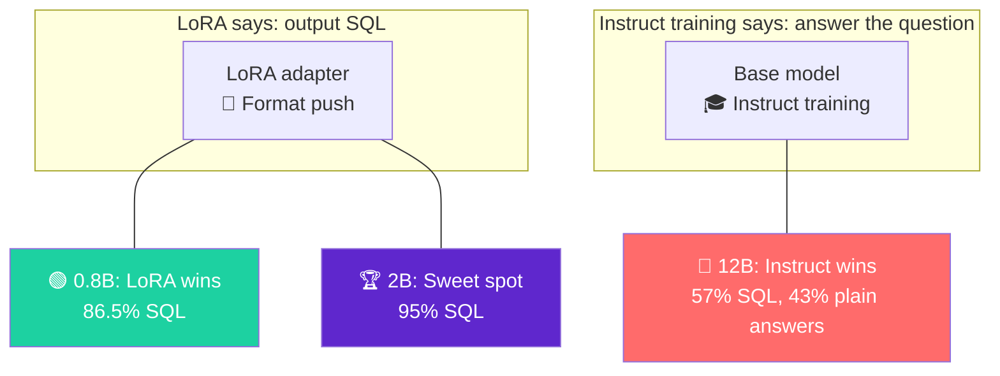

<h1 align="center">🧠 Fine-Tune Qwen3.5 for Text-to-SQL — On Your Mac</h1>

<p align="center">
  <strong>Your M-series Mac is a training rig. You just didn't know it yet.</strong>
</p>

<p align="center">
  
  
  
  
  
</p>

<p align="center">
  <code>uv sync → train → eval</code> — that's it.
</p>

---

## 📑 Table of Contents

- [💡 The Problem](#-the-problem-everyone-has)
- [🎯 What You'll Build](#-what-youll-build)
- [🔬 The Experiment](#-the-experiment) — our 4-step journey from 0% to 50%
- [🚀 Quickstart](#-quickstart) — up and running in 2 minutes
- [🎮 Experiment Ideas](#-experiment-ideas) — where to play and what to tweak
- [📊 Training Benchmarks](#-training-benchmarks)
- [🧬 How LoRA Works](#-how-lora-works-30-second-version)
- [📦 Dataset](#-dataset)
- [⚖️ How We Compare](#%EF%B8%8F-how-we-compare) — vs GPT-4o, Prem-1B-SQL, Oxen.ai
- [⚠️ Limitations](#%EF%B8%8F-limitations--honest-assessment)
- [🛠️ Troubleshooting](#%EF%B8%8F-troubleshooting)
- [📚 Resources](#-resources)

---

## 💡 The Problem Everyone Has

You want to fine-tune an LLM. Your options:

| Option | Cost | Setup Time | Pain Level |
|--------|------|------------|------------|
| ☁️ Rent an A100 on AWS | $3.50/hr | 2 hours | SSH, CUDA drivers, OOM |
| 📓 Google Colab Pro | $10/mo | 30 min | Timeouts, disk limits |
| **🍎 Your Mac with MLX** | **$0** | **2 min** | **`uv sync`, done** |

The secret: Apple Silicon's **unified memory** means your 16/36/64/96 GB of RAM _is_ your VRAM. No data transfers between CPU and GPU. No OOM surprises. The model lives in one place, and the GPU reads it directly.

---

## 🎯 What You'll Build

A fine-tuned LLM that generates SQL queries from natural language — in **600 iterations**, on your Mac. We tested 4 models to find the sweet spot.

```
You: "What is the total population of cities in California?"
  → SELECT SUM(population) FROM cities WHERE state = 'California'
```

---

## 🔬 The Experiment

We asked one question: **what's the cheapest way to teach a small model a new skill?**

The task: given a database schema and a natural language question, generate the correct SQL query. We kept everything identical across all runs — same dataset, same hyperparameters, same 600 iterations — and only changed the model.


### Step 1️⃣ — Does the base model already know SQL?

First sanity check — does Qwen3.5-0.8B (4-bit) already generate SQL without any fine-tuning?

```
Prompt:  CREATE TABLE employees (...); INSERT INTO employees VALUES (...);
         Q: Who earns more than 100k in Engineering?
         A:

Base model output:  "Based on the provided schema, there is no specific
                     column that indicates salary..." (wrong — salary IS in the schema)
```

On 200 test examples: **0% valid SQL**. The model either hallucinates text answers, outputs raw numbers (`42`, `300`), or generates infinite repetition.

### Step 2️⃣ — Can prompt engineering fix it?

Before investing in fine-tuning, we tried the obvious shortcut — just add "Only answer in SQL" to the prompt:

| Approach | SQL Rate | Exact Match |
|----------|----------|-------------|
| ❌ Base model (no instruction) | 0% | 0% |
| ⚠️ Base + "Only answer in SQL" | 1.5% | 0% |
| ✅ **LoRA fine-tuning (600 iters)** | **86.5%** | **24.5%** |

> **"Can't I just add 'answer in SQL' to the prompt?"** — We tested it. The model still computes answers in its head (`42`, `300`) instead of writing queries. Prompt engineering doesn't work at this model size. Fine-tuning teaches a deep behavioral pattern.

### Step 3️⃣ — Fine-tune with LoRA

600 iterations. 15 minutes. 0.48% of parameters trained:

| Metric | Before | After | Delta |
|--------|--------|-------|-------|
| Generates valid SQL | 0% | **86.5%** | 🟢 +86.5pp |
| Semantically correct | 0% | **47.0%** | 🟢 +47.0pp |
| Exact match | 0% | **24.5%** | 🟢 +24.5pp |

Manual review of all 200 test outputs shows **47% are semantically correct** — nearly double the 24.5% exact match, which penalizes valid rewrites like alias differences (`t.name` vs `name`), dialect variations (`DATE_SUB` vs `DATEADD`), and equivalent logic (`ORDER BY DESC LIMIT 1` vs subquery).

### Step 4️⃣ — Does bigger = better?

We ran the same experiment across 4 models — same data, same hyperparameters, same 600 iterations:

| Model | Params | Baseline SQL | Fine-tuned SQL | Δ SQL | Semantic Accuracy | Peak RAM |
|-------|--------|-------------|----------------|-------|-------------------|----------|
| Qwen3.5-0.8B | 0.8B | 0% | 86.5% | +86.5pp | 47.0% | 3.9 GB |
| 🏆 **Qwen3.5-2B** | 1.9B | 3.5% | **95.0%** | **+91.5pp** | **50.0%** | 5.9 GB |
| Qwen3.5-4B* | 4.2B | 8.5% | 71.0% | +62.5pp | 40.0% | 11.1 GB |
| Mistral-Nemo-12B | 12.2B | 26.5% | 57.0% | +30.5pp | 31.0% | 8.2 GB |

**The 2B model wins.** And the reason is counterintuitive:

### 🪞 The Format Compliance Paradox



Larger models are *too smart* to follow the format. The 12B Mistral can actually compute the answer in its head — so it outputs `42` instead of `SELECT COUNT(*) FROM ...`. It answered with plain numbers **43% of the time**.

When models DO write SQL, quality is surprisingly similar (~54%) across all sizes. The difference is entirely about **format compliance**. The 2B is the Goldilocks zone.

> 📄 Full analysis with error breakdowns: [`results/grand-comparison.md`](results/grand-comparison.md)
>
> *\*4B required manual vision weight stripping — Qwen3.5 is natively multimodal, and the vision weights crash MLX LoRA training.*

---

## 🚀 Quickstart

> **Requirements**: Apple Silicon Mac (M1+) with 16 GB+ RAM, Python 3.10+, [uv](https://docs.astral.sh/uv/). That's it.

### 1. Clone & install

```bash
git clone https://github.com/sciences44/mlx-lora-finetune.git
cd mlx-lora-finetune

# One command. No venv, no pip, no activate.
uv sync
```

<details>
<summary>📦 Don't have uv? Install it first</summary>

```bash
curl -LsSf https://astral.sh/uv/install.sh | sh
```
</details>

### 2. Prepare the dataset

```bash
uv run python scripts/prepare_data.py
```

Downloads [gretelai/synthetic_text_to_sql](https://huggingface.co/datasets/gretelai/synthetic_text_to_sql) from HuggingFace (100K examples across 100 domains), filters to basic SQL and single-join complexity, and outputs 5,000 train / 500 valid / 1,000 test examples.

<details>
<summary>📄 Data format (text JSONL)</summary>

```jsonl
{"text": "CREATE TABLE cities (name VARCHAR, state VARCHAR, population INT);\nQ: Total population in California?\nA: SELECT SUM(population) FROM cities WHERE state = 'California';"}
```
</details>

### 3. Fine-tune with LoRA

```bash
bash scripts/train.sh
```

All parameters are configurable via environment variables:

```bash
# Try the 2B model (best results in our comparison)
MODEL=mlx-community/Qwen3.5-2B-4bit-OptiQ bash scripts/train.sh

# Low-memory mode for 16 GB Macs
BATCH_SIZE=1 NUM_LAYERS=4 bash scripts/train.sh

# Quick experiment (100 iters, ~2 min)
ITERS=100 bash scripts/train.sh
```

You'll see output like:

```
Trainable parameters: 0.479% (3.608M/752.392M)
Iter 1:   Val loss 1.390
Iter 100: Train loss 0.810, Tokens/sec 267.5, Peak mem 8.19 GB
Iter 200: Val loss 0.709
Iter 400: Val loss 0.690
Iter 600: Val loss 0.617, Train loss 0.593
```

> 💡 **Memory guide**: 16 GB → `BATCH_SIZE=1 NUM_LAYERS=4`. 32 GB+ → `BATCH_SIZE=4`. 64 GB+ → `BATCH_SIZE=4 GRAD_CHECKPOINT=""` (disable grad checkpoint for speed).

### 4. Evaluate

```bash
# Compare fine-tuned vs base model
uv run python scripts/evaluate.py --num-samples 200

# Base model only (no adapter needed)
uv run python scripts/evaluate.py --baseline --num-samples 200

# Evaluate a different model
uv run python scripts/evaluate.py --model mlx-community/Qwen3.5-2B-4bit-OptiQ --adapter-path adapters-2b
```

### 5. Test your fine-tuned model 🎉

```bash
uv run python -m mlx_lm generate \
  --model mlx-community/Qwen3.5-0.8B-4bit-OptiQ \
  --adapter-path adapters \
  --max-tokens 100 \
  --prompt "CREATE TABLE employees (Name VARCHAR, Department VARCHAR, Salary INT, Start_Date DATE);
Q: Who earns more than 100k in Engineering?
A: "
```

Try it **without** the adapter to see the difference:

```bash
# Same prompt, no adapter — see what the base model does
uv run python -m mlx_lm generate \
  --model mlx-community/Qwen3.5-0.8B-4bit-OptiQ \
  --max-tokens 100 \
  --prompt "CREATE TABLE employees (Name VARCHAR, Department VARCHAR, Salary INT, Start_Date DATE);
Q: Who earns more than 100k in Engineering?
A: "
```

### 6. Fuse adapters into a standalone model (optional)

```bash
uv run python -m mlx_lm fuse \
  --model mlx-community/Qwen3.5-0.8B-4bit-OptiQ \
  --adapter-path adapters \
  --save-path ./fused-model
```

---

## 🎮 Experiment Ideas

Done with the quickstart? Here's where it gets fun. Every experiment below takes under 15 minutes.

### 🔄 Try a different model

We tested 4 models — you can reproduce any of them:

| Model | HuggingFace ID | RAM Needed | Our Result |
|-------|---------------|------------|------------|
| Qwen3.5-0.8B | `mlx-community/Qwen3.5-0.8B-4bit-OptiQ` | 4 GB | 47% semantic acc. |
| 🏆 Qwen3.5-2B | `mlx-community/Qwen3.5-2B-4bit-OptiQ` | 6 GB | 50% semantic acc. |
| Mistral-Nemo-12B | `mlx-community/Mistral-Nemo-Instruct-2407-4bit` | 8 GB | 31% semantic acc. |

```bash
# Train the 2B model (our best performer)
MODEL=mlx-community/Qwen3.5-2B-4bit-OptiQ ADAPTER_DIR=adapters-2b bash scripts/train.sh

# Evaluate it
uv run python scripts/evaluate.py --model mlx-community/Qwen3.5-2B-4bit-OptiQ --adapter-path adapters-2b
```

### 📊 Change the dataset size

Edit `scripts/prepare_data.py` — line 16-18:

```python
TRAIN_SIZE = 5000   # Try 10000 or 20000 (up to ~80K available)
VALID_SIZE = 500
TEST_SIZE = 1000
```

Then regenerate: `uv run python scripts/prepare_data.py`

### ⚡ Quick hyperparameter experiments

```bash
# Higher learning rate (faster learning, risk of instability)
LR=5e-5 ITERS=300 bash scripts/train.sh

# More LoRA layers (more capacity, more memory)
NUM_LAYERS=32 bash scripts/train.sh

# Speed run: 100 iters, see how far you get
ITERS=100 bash scripts/train.sh
```

### 🧪 Test the prompt engineering claim yourself

```bash
# Base model — outputs garbage
uv run python -m mlx_lm generate --model mlx-community/Qwen3.5-0.8B-4bit-OptiQ --max-tokens 100 \
  --prompt "CREATE TABLE sustainable_urbanism (id INT, city VARCHAR(50), project_type VARCHAR(50)); INSERT INTO sustainable_urbanism (id, city, project_type) VALUES (1, 'Oakland', 'Affordable Housing'), (2, 'Seattle', 'Green Spaces');
Q: How many sustainable urbanism projects are in Oakland?
A: "

# Same prompt + "Only answer in SQL" — still outputs garbage
uv run python -m mlx_lm generate --model mlx-community/Qwen3.5-0.8B-4bit-OptiQ --max-tokens 100 \
  --prompt "CREATE TABLE sustainable_urbanism (id INT, city VARCHAR(50), project_type VARCHAR(50)); INSERT INTO sustainable_urbanism (id, city, project_type) VALUES (1, 'Oakland', 'Affordable Housing'), (2, 'Seattle', 'Green Spaces');
Q: How many sustainable urbanism projects are in Oakland?
A: Note: Only answer in SQL.
"

# Fine-tuned — outputs correct SQL
uv run python -m mlx_lm generate --model mlx-community/Qwen3.5-0.8B-4bit-OptiQ --adapter-path adapters --max-tokens 100 \
  --prompt "CREATE TABLE sustainable_urbanism (id INT, city VARCHAR(50), project_type VARCHAR(50)); INSERT INTO sustainable_urbanism (id, city, project_type) VALUES (1, 'Oakland', 'Affordable Housing'), (2, 'Seattle', 'Green Spaces');
Q: How many sustainable urbanism projects are in Oakland?
A: "
```

### 📝 Use your own data

Create `data/train.jsonl`, `data/valid.jsonl`, `data/test.jsonl` with this format:

```jsonl
{"text": "CREATE TABLE orders (id INT, amount DECIMAL);\nQ: List all orders above $500\nA: SELECT * FROM orders WHERE amount > 500"}
```

Then train: `bash scripts/train.sh`. Works with any text-to-X task — code generation, translation, summarization.

---

## 📊 Training Benchmarks

Real numbers from an M1 64 GB:

| Model | Size (4-bit) | Adapter | Trainable Params | Peak RAM | Tokens/sec | Time |
|-------|-------------|---------|------------------|----------|------------|------|
| Qwen3.5-0.8B | 570 MB | 14 MB | 3.6M (0.48%) | 3.9 GB | ~475 | ~15 min |
| Qwen3.5-2B | 1.1 GB | 25 MB | 6.8M (0.36%) | 5.9 GB | ~180 | ~8 min |
| Qwen3.5-4B | 2.4 GB | 42 MB | 13.6M (0.32%) | 11.1 GB | ~115 | ~12 min |
| Mistral-Nemo-12B | 6.9 GB | 56 MB | 18.0M (0.15%) | 8.2 GB | ~210 | ~8 min |

> 📉 **Loss converges by ~600 iters** — we tested 1,000 iters and saw no improvement in eval metrics. 600 is the sweet spot.

---

## 🧬 How LoRA Works (30-second version)

```
Full fine-tuning:      Update ALL parameters  → huge memory
LoRA:                  Freeze model, train tiny adapters → 0.48% of params
QLoRA:                 Same, but model is 4-bit quantized → fits in 8 GB
```

```
┌──────────────────────────────────┐
│         Frozen LLM Weights       │  ← 4-bit quantized (QLoRA)
│         (752M parameters)        │     Untouched during training
├──────────────────────────────────┤
│  ┌──────┐          ┌──────┐     │
│  │LoRA A│ (rank r) │LoRA B│     │  ← Only these train
│  │64×4  │    ×     │4×64  │     │     ~0.48% of parameters
│  └──────┘          └──────┘     │
├──────────────────────────────────┤
│    Output = Frozen + (A × B)    │  ← Merged at inference
└──────────────────────────────────┘
```

The genius: instead of updating millions of weight values, you decompose the update into two tiny matrices. Same result, fraction of the compute.

---

## 📦 Dataset

**[gretelai/synthetic_text_to_sql](https://huggingface.co/datasets/gretelai/synthetic_text_to_sql)** — 100K synthetic text-to-SQL examples across 100 domains (healthcare, finance, education, etc.) with multiple complexity levels.

We filter to **basic SQL** and **single join** complexity — clean, learnable examples appropriate for a 0.8B parameter model:

| Split | Size | Purpose |
|-------|------|---------|
| Train | 5,000 | LoRA fine-tuning |
| Valid | 500 | Loss monitoring during training |
| Test | 1,000 | Evaluation (200 used for benchmarks) |

---

## ⚖️ How We Compare

Text-to-SQL is a well-studied benchmark. Here's how our results stack up:

| Project | Model | Params | Data | Hardware | Metric | Score |
|---------|-------|--------|------|----------|--------|-------|
| 🍎 **This repo (0.8B)** | Qwen3.5-0.8B | 0.8B | 5K | Mac, LoRA | Semantic acc. | **47%** |
| 🍎 **This repo (2B)** | Qwen3.5-2B | 1.9B | 5K | Mac, LoRA | Semantic acc. | **50%** |
| [Oxen.ai](https://ghost.oxen.ai/how-to-fine-tune-qwen3-to-gpt-4o-level-performance/) | Qwen3-0.6B | 0.6B | 5K | A10G, full FT | LLM-as-judge | 42% |
| [Oxen.ai](https://ghost.oxen.ai/how-to-fine-tune-qwen3-to-gpt-4o-level-performance/) | Qwen3-1.7B | 1.7B | 5K | A10G, full FT | LLM-as-judge | 57% |
| [Oxen.ai](https://ghost.oxen.ai/how-to-fine-tune-qwen3-to-gpt-4o-level-performance/) | GPT-4o | — | zero-shot | API | LLM-as-judge | 45% |
| [Prem-1B-SQL](https://blog.premai.io/prem-1b-sql-fully-local-performant-slm-for-text-to-sql/) | DeepSeek-1.3B | 1.3B | 122M tok | 4× A100, full FT | Exec acc. (Spider) | 85% |
| [Databricks](https://www.databricks.com/blog/improving-text2sql-performance-ease-databricks) | Llama3-8B | 8B | Spider | A100, full FT | Exec acc. (Spider) | 79.9% |

**Key takeaways:**

- ✅ **We're in the right ballpark.** Our 0.8B at 47% is close to Oxen.ai's 0.6B at 42% — both use ~5K examples with similar-sized Qwen models.
- 🏆 **Our 2B at 50% beats GPT-4o zero-shot** (45%), which is a compelling result for a 15-minute local fine-tune.
- 📏 **The gap to SOTA is real but explained.** Prem-1B-SQL hits 85% on Spider, but uses full fine-tuning (not LoRA), 24× more data, 4× A100 GPUs, and execution-guided decoding. That's a different budget and scope.
- 📐 **Metrics aren't directly comparable.** We use semantic accuracy (manual review), others use execution accuracy (run SQL against a database) or LLM-as-judge. Execution accuracy is the gold standard.

> The point of this repo isn't to beat SOTA. It's to show that **a Mac, 15 minutes, and 5K examples** gets you surprisingly far.

---

## ⚠️ Limitations & Honest Assessment

This is a learning project, not a production system. Here's what we didn't push:

<details>
<summary>🔍 What we tested</summary>

- 1 dataset (synthetic text-to-SQL)
- 1 set of hyperparameters (LR 1e-5, 600 iters, 16 LoRA layers, rank 8)
- 1 prompt format (text completion, no chat template)
- 4 models (Qwen3.5 0.8B/2B/4B, Mistral-Nemo 12B)
- 200 test examples per model (from 1,000 available)
</details>

### 🔧 What could improve results

| Lever | Current | Could try | Expected impact |
|-------|---------|-----------|-----------------|
| Training data | 5K examples | 20–50K (from 100K available) | 🟢 High |
| Evaluation | String match + manual review | Execution accuracy (SQLite) | 🟢 High |
| Prompt format | Text completion | Chat template (for 4B+ models) | 🟡 Medium |
| LoRA layers | 16 (all models) | 32+ for larger models | 🟡 Medium |
| LoRA rank | 8 | 16 or 32 | 🟡 Medium |
| Hyperparameters | Single run (LR 1e-5) | Grid search | 🟡 Medium |
| Training duration | 600 iters (all models) | LR schedule + more iters for 4B+ | 🟠 Low-Medium |
| Fine-tuning method | LoRA (0.48% params) | Full fine-tune | 🟢 High (but needs GPU) |

### ✅ What this project does demonstrate

- **LoRA works on Apple Silicon** — from 0% to 86.5% SQL in 15 minutes
- **Model size has a sweet spot** — 2B beats both smaller and larger models
- **Prompt engineering isn't a substitute** — 1.5% vs 86.5% SQL rate
- **Val loss is misleading** — lowest val loss (4B) ranked 3rd in accuracy
- **Exact match underestimates quality** — 24.5% exact match vs 47.0% actual correctness

---

## 🗂️ Project Structure

```
mlx-lora-finetune/
├── 📄 README.md
├── 📦 pyproject.toml           # uv managed dependencies
├── 📁 data/
│   ├── train.jsonl             # 5K training examples
│   ├── valid.jsonl             # 500 validation examples
│   └── test.jsonl              # 1K test examples
├── 📁 scripts/
│   ├── prepare_data.py         # Dataset download + formatting
│   ├── evaluate.py             # Exact match evaluation
│   └── train.sh                # Training wrapper script
├── 📁 adapters/                # LoRA adapter weights (after training)
└── 📁 results/
    ├── eval_results.json       # Evaluation metrics
    └── grand-comparison.md     # Full multi-model analysis
```

---

## 🛠️ Troubleshooting

| Problem | Fix |
|---------|-----|
| `Insufficient Memory` (Metal OOM) | Reduce `--batch-size` to 1, add `--grad-checkpoint` |
| Slow training | Close Chrome and other apps (they share unified memory) |
| High val loss | More data, more iters, or try `--learning-rate 5e-6` |
| Model outputs numbers instead of SQL | Check data format — each line must be `{"text": "..."}` |
| `uv: command not found` | `curl -LsSf https://astral.sh/uv/install.sh \| sh` |
| Chat template errors | Use text format (not completions) — Qwen3.5 has a thinking template |
| 2B+ model swapping to disk | Reduce `--batch-size` to 1 — we hit 97% RAM on M1 64 GB with batch 2 |

---

## 📚 Resources

| Resource | Description |
|----------|-------------|
| [MLX Documentation](https://ml-explore.github.io/mlx/) | Apple's ML framework |
| [MLX-LM](https://github.com/ml-explore/mlx-lm) | Production-ready LLM tools |
| [MLX Community](https://huggingface.co/mlx-community) | Pre-converted models on HuggingFace |
| [Qwen3.5 0.8B 4-bit](https://huggingface.co/mlx-community/Qwen3.5-0.8B-4bit-OptiQ) | The primary model used here |
| [gretelai/synthetic_text_to_sql](https://huggingface.co/datasets/gretelai/synthetic_text_to_sql) | Training dataset |
| [LoRA Paper](https://arxiv.org/abs/2106.09685) | The original research |
| [QLoRA Paper](https://arxiv.org/abs/2305.14314) | Quantized adaptation |
| [uv](https://docs.astral.sh/uv/) | Modern Python package management |

---

<p align="center">
  <b>Built on a Mac. No cloud. No CUDA. 🍎</b>
  <br/><br/>
  Made by <a href="https://github.com/sciences44"><b>Sciences44</b></a> · <a href="https://sciences44.substack.com/subscribe">Subscribe for more</a>
</p>
